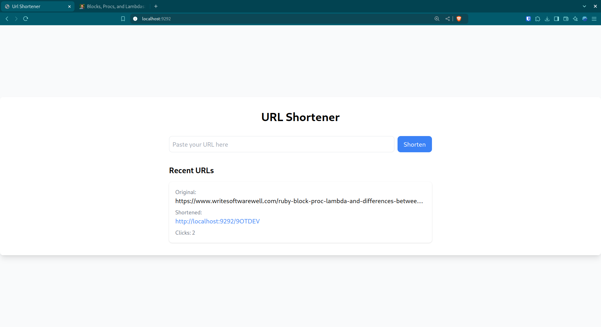

# URL Shortener

[](https://www.ruby-lang.org)
[](http://sinatrarb.com/)
[](https://www.mysql.com/)

A simple and efficient URL shortener built with Sinatra and MySQL. It generates unique 6-character short URLs and tracks access statistics.

## 🚀 Technologies

- Ruby 3.3.0
- Sinatra
- MySQL 8.0
- TailwindCSS
- Docker & Docker Compose

### Main Gems
- `sinatra`
- `sinatra-tailwind`
- `sequel` (ORM)
- `mysql2`
- `dotenv`
- `foreman`

## 📁 Project Structure
```
├── app/
│   ├── controllers/          # Application controllers
│   │   └── app.rb            # Main controller
│   ├── models/               # Application models
│   │   └── url.rb            # URL model
│   └── views/                # ERB views
│       ├── index.erb
│       └── layout.erb
├── bin/
│   └── dev                   # Development script
├── config/
│   ├── migrate.rb            # Migration configuration
│   └── migrations/           # Migration files
│       └── 002_add_access_count.rb
├── db/
│   └── db.rb                 # Database configuration
├── public/
│   └── css/                  # CSS files
│       ├── application.css
│       └── application.min.css
├── test/                     # Automated tests
│   ├── features/             # Feature tests
│   ├── models/               # Model tests
│   └── test_helper.rb
├── config.ru                 # Rack configuration
├── Dockerfile
├── docker-compose.yml
├── entrypoint.sh
├── Gemfile
├── Procfile.dev
├── Rakefile
└── tailwind.config.js
```

## 📋 Prerequisites

- Docker
- Docker Compose

## 🔧 Installation

1. Clone the repository
```bash
git clone https://github.com/isaaclvs/url-shortener.git
cd url-shortener
```

2. Set up environment variables
```bash
cp .env.example .env
```

3. Start containers
```bash
docker compose up
```

4. Access the application at `http://localhost:9292`

## 💻 Development

### Useful Commands

#### Start the application
```bash
docker compose up
```

#### Rebuild containers
```bash
docker compose up --build
```

#### Stop the application
```bash
docker compose down
```

#### Run tests
```bash
docker compose exec web rake test
```

### Database
- Host: `localhost`
- Port: `3307`
- Database: `url_shortener`

## 🧪 Tests

The project includes automated tests:
- Feature tests in `test/features/`
- Model tests in `test/models/`
- Run tests using the appropriate command

## 📸 Screenshots


*Home Page*

## 👤 Author

**Isaac Alves**

## 📝 License

This project is licensed under the [MIT](LICENSE.md) License.